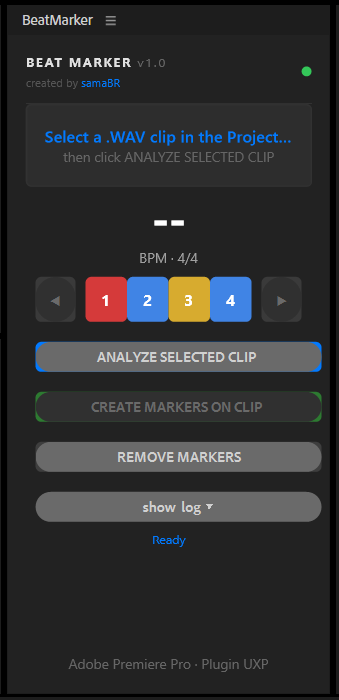
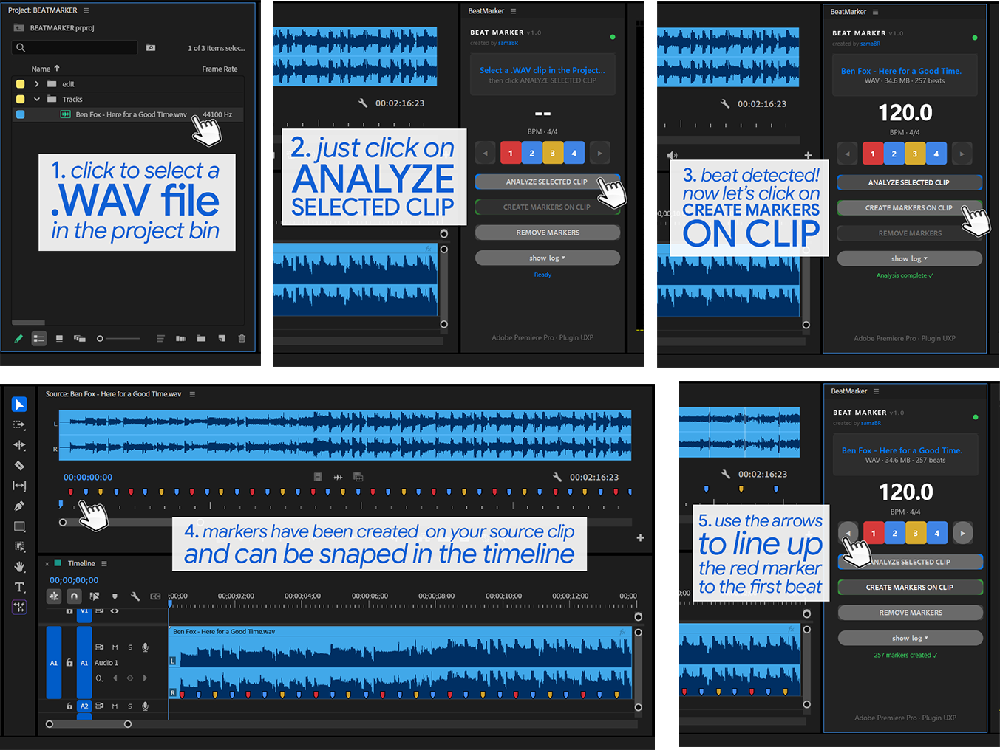
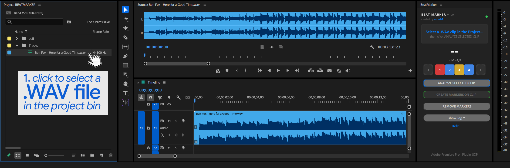
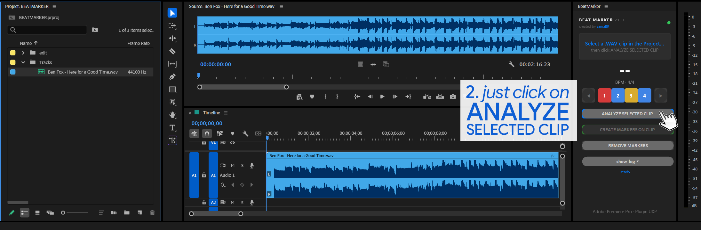
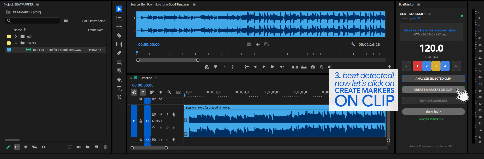
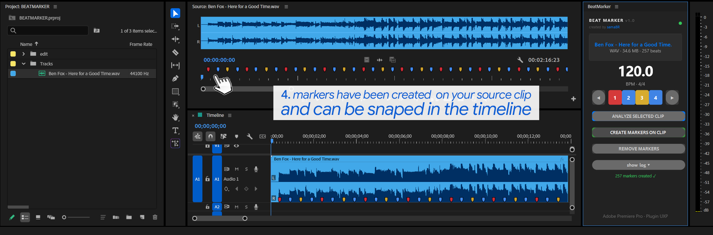
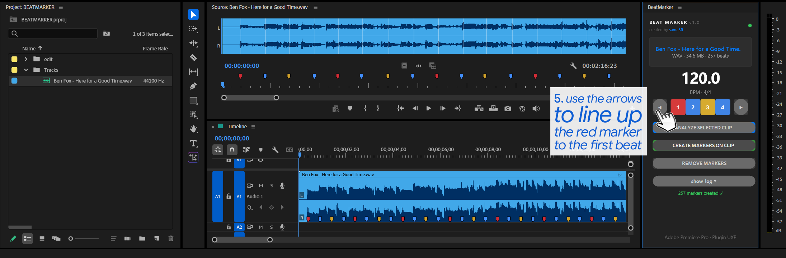

# BeatMarker

[](https://www.gnu.org/licenses/gpl-3.0)


**UXP Plugin for Adobe Premiere Pro** that automatically detects beats in an audio track and creates colored markers on the source clip — giving editors a precise visual rhythm reference for music-synced cuts.



---

## ✨ Features

- 🎵 **Detects BPM and beats** in WAV files with one click
- 🎨 **Creates colored markers** on the source clip, visually distinguishing each beat position:
  - 🔴 Beat **1** → Red
  - 🔵 Beats **2 & 4** → Blue
  - 🟡 Beat **3** → Yellow
- ◀ ▶ **Phase adjustment** — shifts which beat is the "1" without re-analyzing
- 🗑️ **Remove markers** with one click (any clip selected in the Project panel)
- 🌐 **Bilingual (ENG / PT-BR)** — UI language automatically detected from system locale

---

## 🎬 Who it's for

Video editors who cut to the beat — music videos, trailers, reels, sync edits. No music theory required. Works on **Windows and macOS** from the same installer.

---

## 🚀 How to use



| Step | Action |
|------|--------|
| **1** | Open the **BeatMarker** panel (`Window → Extensions → BeatMarker`) and select a `.WAV` clip in the Project panel |
| **2** | Click **ANALYZE SELECTED CLIP** and wait for the BPM to be detected |
| **3** | Click **CREATE MARKERS ON CLIP** — colored markers appear on the clip |
| **4** | If beat "1" is in the wrong place, use **◀ ▶** to shift the phase |
| **5** | To start over, click **REMOVE MARKERS** |

<details>
<summary>📸 View individual steps</summary>

**Step 1 — Select clip & open panel**


**Step 2 — Analyze**


**Step 3 — Create markers**


**Step 4 — Adjust phase if needed**


**Step 5 — Remove markers**


</details>

---

## 🛠️ Dev install

### Prerequisites
- Adobe Premiere Pro 25.0+
- [UXP Developer Tool](https://developer.adobe.com/photoshop/uxp/devtool/)

### Steps

```bash
git clone https://github.com/samaBR85/BeatMarker-PremierePlugin.git
```

1. Open the **UXP Developer Tool**
2. Click **Add Plugin**
3. Navigate to the `plugin/` folder and select `manifest.json`
4. Click **Load** in Premiere Pro

The `analysis-bundle.js` is pre-compiled inside `plugin/` — no build step needed to run the plugin.

---

## 🔨 Rebuild the bundle

Only needed if you modify the audio analysis code in `experiments/exp-b-uxp-viability/src/`.

```bash
cd experiments/exp-b-uxp-viability
npm install
npm run build

# Copy to plugin:
# Windows:
copy analysis-bundle.js ..\..\plugin\analysis-bundle.js
# macOS/Linux:
cp analysis-bundle.js ../../plugin/analysis-bundle.js
```

---

## 📁 Project structure

```
BeatMarker-PremierePlugin/
│
├── plugin/                        ← Ready-to-install plugin
│   ├── manifest.json              ← UXP manifest v5
│   ├── index.html                 ← Panel UI
│   ├── main.js                    ← UXP logic + Premiere API + i18n
│   └── analysis-bundle.js        ← Pre-compiled bundle (WAV decoder + music-tempo)
│
├── experiments/
│   ├── exp-a-beat-detection/      ← Node.js proof of concept (mpg123 + music-tempo)
│   └── exp-b-uxp-viability/       ← Bundle source
│       ├── src/
│       │   ├── analysis.js        ← Pipeline: WAV decoder + resample + beat detection
│       │   └── stubs/             ← Polyfills for modules missing in UXP
│       ├── build.js               ← esbuild config
│       └── package.json
│
├── screenshots/                   ← Usage screenshots
├── assets/                        ← Icon source files
├── SPEC.md                        ← Full technical spec
├── INSTALL.md                     ← End-user installation guide
└── README.md
```

---

## ⚙️ Tech stack

| Component | Technology |
|---|---|
| Runtime | UXP (Unified Extensibility Platform) — manifest v5 |
| UI | HTML + CSS + vanilla JavaScript |
| WAV decoding | Pure JS via DataView — PCM 8/16/24-bit + float32, any sample rate |
| Beat detection | music-tempo |
| Bundler | esbuild |
| i18n | Auto-detected via `navigator.language` |

### Why no WASM

| Technology | Problem |
|---|---|
| WASM with pthreads | Crashes Premiere Pro immediately |
| Web Workers | `typeof Worker === 'undefined'` in UXP |
| `AudioContext` | Does not exist in UXP |
| `fs.readFileSync` | "Route not found" in UXP |

---

## 🌐 Languages

The UI language is detected automatically from the system locale — no configuration needed.

| Language | Locale |
|---|---|
| 🇧🇷 Portuguese (PT-BR) | `pt`, `pt-BR` |
| 🇺🇸 English | all other locales |

---

## ⚠️ Known limitations

- Only `.WAV` files are accepted (**4/4 time signature** only)
- No support for variable tempo (rubato, accelerando, ritardando)

---

## 📄 License

This project is licensed under the **GNU GPL v3** — any derivative work must also be open source.

### Third-party licenses

- [music-tempo](https://github.com/killiansheriff/music-tempo) — MIT

---

## 👤 Credits

Created by **[samaBR](https://github.com/samaBR85)**
